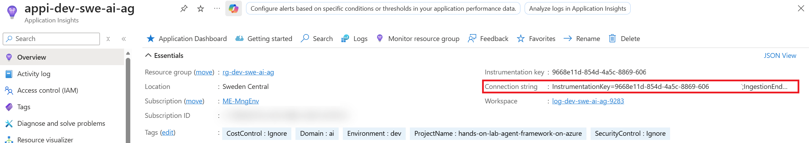
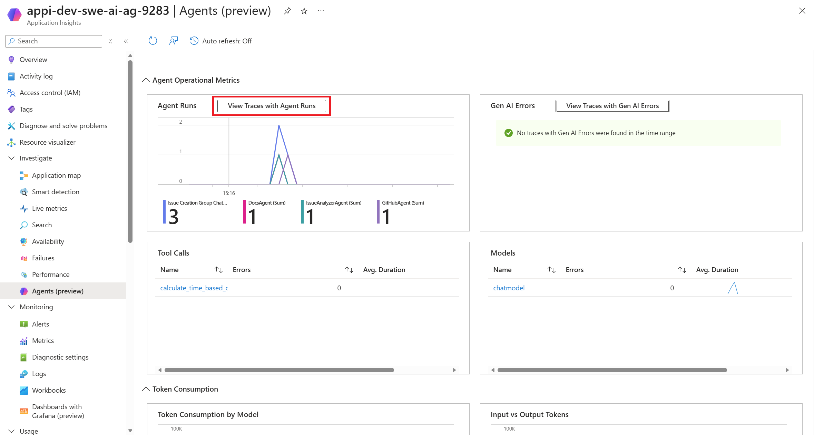
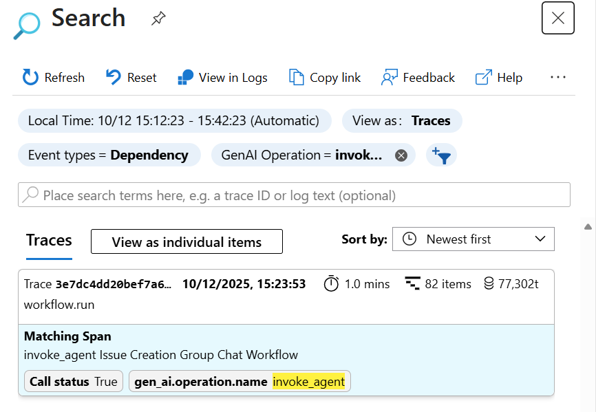
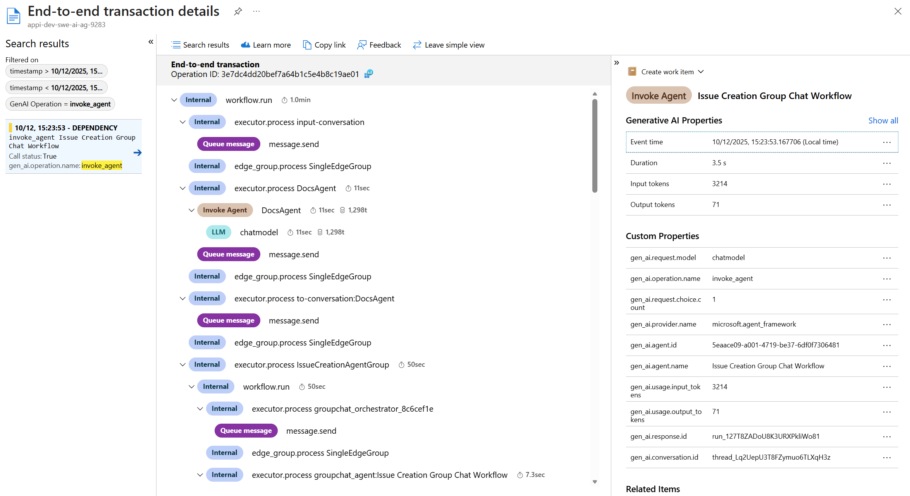

# Product Hands-on Lab - Agent Framework on Azure

Welcome to this hands-on lab! In this workshop, you will learn how to build agentic applications using the Agent Framework on Azure. this workshop is available in Python, but don't forget that the Agent Framework is also available in C#.

## What You Will Learn

In this hands-on lab, you will build a **Helpdesk Ops Assistant** powered by AI agents. This multi-agent system will handle internal support tickets by leveraging enterprise best practices (RAG), MCP servers, and native tools to provide intelligent assistance.

But firstly what's an AI agent?

An **AI agent** is a software component that uses a generative AI model to understand an input (a user request, an event, or another agent message), reason about what to do next, and then **take actions**.
In practice, an agent becomes useful when it can combine:

- **Knowledge** (for example, retrieving guidance or documentation)
- **Tools** (calling functions/APIs to do real work)

In this workshop, you will build multiple agents and orchestrate them so the system can analyze a ticket, look up relevant documentation, and create/update GitHub issues.

<div class="tip" data-title="Go deeper">

> If you want a broader (non-code) view of what an AI agent is and how to adopt agents in an organization, read: 
> [AI agent adoption (Cloud Adoption Framework)](https://learn.microsoft.com/en-us/azure/cloud-adoption-framework/ai-agents/)
>
> It explains what makes agents different from classic RAG (agents decide *which* knowledge and tools to use step-by-step), outlines the core building blocks (model, instructions, retrieval/knowledge, actions/tools, memory), and provides guidance across the lifecycle: **plan**, **govern & secure**, **build**, and **operate** agents.

</div>

<details>
<summary><strong>Context (optional): Why LLMs (GenAI agents) are relevant here</strong></summary>

Helpdesk requests are mostly **unstructured text** (short descriptions, partial context, logs, mixed intents). LLM-based agents work well for this because they can:

- Extract structure from messy inputs (title, summary, root-cause hints) without a dedicated NLP pipeline.
- Combine reasoning with **tools** (deterministic calculations) and **RAG** (company guidelines, docs) instead of relying on memorized knowledge.
- Adapt quickly as policies and documentation change (update the knowledge base and prompts, not a trained model).

Classic NLP/ML can be a great choice when you have stable categories and lots of labeled data (for example, high-volume ticket routing). For this workshop, the goal is an end-to-end assistant that can understand, retrieve context, and take actions rapidly with minimal setup.

</details>

### The Multi-Agent Architecture

You will create a multi-agent system built as a **sequence**: first the DocsAgent retrieves relevant documentation, then a **group chat** (managed by an orchestrator agent) coordinates the IssueAnalyzerAgent and GitHubAgent to complete the task.

```text
User / Prompt
        |
        v
    Step 1 (Sequential): Documentation lookup
        |
        v
    +---------------------+            +----------------------+
    |      DocsAgent      | --MCP-->   |   Microsoft Learn    |
    |    (MCP: mslearn)   |            +----------------------+
    +----------+----------+
                         |
                         | Relevant docs/context
                         v
    Step 2 (Group Chat): Execution managed by an Orchestrator
                         |
                         v
                     +-----------------------------+
                     |      Orchestrator Agent     |
                     |   (Group Chat / Manager)    |
                     +------+-----------+----------+
                            |           |
                            | routes    | routes
                            v           v
        +---------------------+     +---------------------+
        |  IssueAnalyzerAgent |     |      GitHubAgent    |
        | (Pydantic outputs + |     |     (MCP: GitHub)   |
        |  native tools)      |     |  create/update      |
        +----------+----------+     |      issues         |
                   |                +----------+----------+
                   | native tools              |
                   v                           | MCP calls
        +---------------------+                v
        |  Local tool calls   |           +-----------+
        | (time estimates...) |           |   GitHub  |
        +---------------------+           +-----------+
```

**IssueAnalyzerAgent**  
Analyzes support tickets using structured data contracts (Pydantic models), determines issue complexity, and provides detailed analysis of bugs and feature requests. This agent uses native tools to calculate accurate time estimates based on complexity levels.

**GitHubAgent (MCP github)**  
Executes GitHub ticketing actions (creating issues, adding labels, posting comments) based on the analysis provided by other agents. This agent leverages company-specific guidelines through RAG integration with your knowledge base.

**DocsAgent (MCP mslearn)**  
Queries Microsoft Learn documentation via MCP "mslearn" server to provide relevant documentation citations and technical guidance for issue resolution.

### Key Technologies

Throughout this workshop, you will:
- Build agentic applications using **[Agent Framework][agent-framework-url]**
- Integrate **Microsoft Foundry** for AI model deployment and knowledge management
- Implement **Retrieval-Augmented Generation (RAG)** with vector stores and Foundry IQ
- Use **Model Context Protocol (MCP)** servers for GitHub and Microsoft Learn integration
- Structure agent responses with **data contracts** using Pydantic models
- Create and use **native tools** for business logic (time estimation based on complexity)
- Orchestrate agents using **Group Chat patterns** and **Sequential Workflows**
- Leverage **Dev UI** for rapid agent development and testing
- Build knowledge bases using **Foundry IQ managed indexes**

By the end of this lab, you will have a fully functional helpdesk system where multiple AI agents collaborate to analyze issues, retrieve relevant documentation, and manage tickets automatically following company guidelines.

[agent-framework-url]: https://github.com/microsoft/agent-framework

---

## Prerequisites

Before starting this lab, be sure to set your Azure environment :

- An Azure Subscription with the **Contributor** role to create and manage the labs' resources and deploy the infrastructure as code
- Register the Azure providers on your Azure Subscription if not done yet: `Microsoft.CognitiveServices`.

To retrieve the lab content :

- A Github account (Free, Team or Enterprise)
- Create a [fork][repo-fork] of the repository from the **main** branch to help you keep track of your changes

3 development options are available:
  - 🥇 *Preferred method* : Pre-configured GitHub Codespace 
  - 🥈 Local Devcontainer
  - 🥉 Local Dev Environment with all the prerequisites detailed below

<div class="tip" data-title="Tips">

> To focus on the main purpose of the lab, we encourage the usage of devcontainers/codespace as they abstract the dev environment configuration, and avoid potential local dependencies conflict.
> 
> You could decide to run everything without relying on a devcontainer : To do so, make sure you install all the prerequisites detailed below.

</div>

### 🥇 : Pre-configured GitHub Codespace

To use a Github Codespace, you will need :
- [A GitHub Account][github-account]

Github Codespace offers the ability to run a complete dev environment (Visual Studio Code, Extensions, Tools, Secure port forwarding etc.) on a dedicated virtual machine. 
The configuration for the environment is defined in the `.devcontainer` folder, making sure everyone gets to develop and practice on identical environments : No more conflict on dependencies or missing tools ! 

Every Github account (even the free ones) grants access to 120 vcpu hours per month, _**for free**_. A 2 vcpu dedicated environment is enough for the purpose of the lab, meaning you could run such environment for 60 hours a month at no cost!

To get your codespace ready for the labs, here are a few steps to execute : 
- After you forked the repo, click on `<> Code`, `Codespaces` tab and then click on the `+` button:


- You can also provision a beefier configuration by defining creation options and select the **Machine Type** you like : 


### 🥈 : Using a local Devcontainer

This repo comes with a Devcontainer configuration that will let you open a fully configured dev environment from your local Visual Studio Code, while still being completely isolated from the rest of your local machine configuration : No more dependancy conflict.
Here are the required tools to do so : 

- [Git client][git-client] 
- [Docker Desktop][docker-desktop] running
- [Visual Studio Code][vs-code] installed on your machine

Start by cloning the repository you just forked on your local Machine and open the local folder in Visual Studio Code.
Once you have cloned the repository locally, make sure Docker Desktop is up and running and open the cloned repository in Visual Studio Code.  

You will be prompted to open the project in a Dev Container. Click on `Reopen in Container`. 

If you are not prompted by Visual Studio Code, you can open the command palette (`Ctrl + Shift + P`) and search for `Reopen in Container` and select it: 


### 🥉 : Using your own local environment

The following tools and access will be necessary to run the lab on a local environment :  

<div class="tip" data-title="Windows note">

> If you're installing prerequisites with `winget`, open **Windows PowerShell as Administrator**.

</div>

- [Git client][git-client] 
- [Visual Studio Code][vs-code] installed
- [Azure CLI][az-cli-install] installed on your machine
- [Python 3.13][download-python] installed on your machine
- [UV package manager][download-uv] installed on your machine
- [Terraform][download-terraform] installed on your machine

Visual Studio Code Extensions to install :

- [ms-python.python][ms-python-extension]
- [github.copilot][github-copilot-extension]
- [github.copilot-chat][github-copilot-chat-extension]
- [humao.rest-client][humao-rest-client-extension]
- [ms-python.vscode-pylance][ms-python-vscode-pylance-extension]
- [ms-vscode-remote.remote-containers][ms-vscode-remote-containers-extension]
- [charliermarsh.ruff][charliermarsh-ruff-extension]
- [ms-python.debugpy][ms-python-debugpy-extension]
- [hashicorp.terraform][hashicorp-terraform-extension]

Once you have set up your local environment, you can clone the repository you just forked on your machine, and open the local folder in Visual Studio Code and head to the next step. 

### Sign in to Azure

> - Log into your Azure subscription in your environment using Azure CLI and on the [Azure Portal][az-portal] using your credentials.
> - Instructions and solutions will be given for the Azure CLI, but you can also use the Azure Portal if you prefer.
> - Register the Azure providers on your Azure Subscription if not done yet: `Microsoft.CognitiveServices`

```bash
# Login to Azure : 
# --tenant : Optional | In case your Azure account has access to multiple tenants

# Option 1 : Local Environment 
az login --tenant <yourtenantid or domain.com>
# Option 2 : Github Codespace : you might need to specify --use-device-code parameter to ease the az cli authentication process
az login --use-device-code --tenant <yourtenantid or domain.com>

# Display your account details
az account show
# Select your Azure subscription
az account set --subscription <subscription-id>

# Register the following Azure providers if they are not already
# Azure Cognitive Services
az provider register --namespace 'Microsoft.CognitiveServices'
```

### Deploy the infrastructure

First, you need to initialize the terraform infrastructure by running the following command:

<div class="tip" data-title="Local Devcontainer note (Terraform chmod error)">

> If you're using the **local Devcontainer** and Terraform fails during `terraform init` with `chmod ... operation not permitted`, your repository is likely mounted from a host filesystem that doesn't support Linux permission changes.
>
> To make `terraform init` work reliably, store Terraform's internal working data on a Linux filesystem path inside the container (for example `/vscode`):
>
> ```bash
> mkdir -p /vscode/tfdata/plugin-cache
> cd infra
> export TF_DATA_DIR=/vscode/tfdata/infra
> export TF_PLUGIN_CACHE_DIR=/vscode/tfdata/plugin-cache
> terraform init
> ```

</div>

```bash
# Set the subscription ID as an environment variable
export ARM_SUBSCRIPTION_ID=$(az account show --query id -o tsv)

# Initialize terraform
cd infra && terraform init
```

Then run the following command to deploy the infrastructure:

```bash
# Apply the deployment directly
terraform apply -auto-approve
```

HERE

The deployment should take around 5 minutes to complete.

[ms-python-extension]: https://marketplace.visualstudio.com/items?itemName=ms-python.python
[github-copilot-extension]: https://marketplace.visualstudio.com/items?itemName=GitHub.copilot
[github-copilot-chat-extension]: https://marketplace.visualstudio.com/items?itemName=GitHub.copilot-chat
[humao-rest-client-extension]: https://marketplace.visualstudio.com/items?itemName=humao.rest-client
[ms-python-vscode-pylance-extension]: https://marketplace.visualstudio.com/items?itemName=ms-python.vscode-pylance
[charliermarsh-ruff-extension]: https://marketplace.visualstudio.com/items?itemName=charliermarsh.ruff
[ms-python-bandit-extension]: https://marketplace.visualstudio.com/items?itemName=ms-python.bandit
[ms-python-debugpy-extension]: https://marketplace.visualstudio.com/items?itemName=ms-python.debugpy
[hashicorp-terraform-extension]: https://marketplace.visualstudio.com/items?itemName=hashicorp.terraform
[ms-vscode-remote-containers-extension]: https://marketplace.visualstudio.com/items?itemName=ms-vscode-remote.remote-containers
[az-cli-install]: https://learn.microsoft.com/en-us/cli/azure/install-azure-cli
[az-portal]: https://portal.azure.com
[vs-code]: https://code.visualstudio.com/
[azure-function-vs-code-extension]: https://marketplace.visualstudio.com/items?itemName=ms-azuretools.vscode-azurefunctions
[docker-desktop]: https://www.docker.com/products/docker-desktop/
[repo-fork]: https://github.com/damienaicheh/hands-on-lab-agent-framework-on-azure/fork
[git-client]: https://git-scm.com/downloads
[github-account]: https://github.com/join
[download-python]: https://www.python.org/downloads/
[download-uv]: https://docs.astral.sh/uv/
[download-terraform]: https://developer.hashicorp.com/terraform/install

---

## Create your first agent

Let's create a first simple agent using the Agent Framework and a Foundry model to respond to basic queries.

Inside the `src` folder, you will find at root the `pyproject.toml` file that defines the dependencies for your Python project. Make sure to install them using `uv` and activate the virtual environment:

```bash
cd src
# Install dependencies
uv sync
# Activate the virtual environment
source .venv/bin/activate
```

Then, rename the `.env.template` file to `.env` and update the environment variables with the values from your deployed infrastructure.

To connect to the AI chat model you need, you will use the Microsoft Foundry project resource to connect to the deployed models.


Go to [Azure Portal](https://portal.azure.com/#browse/all), inside your resource group, select the Microsoft Foundry project: 

[](./assets/resource-group-foundry-project.png)

Then select `Go to Foundry portal`: 


You will be redirected to the home page of Microsoft Foundry Portal where you will have to copy paste the endpoint

<div class="tip" data-title="Microsoft Foundry portal">

> you can also directly go the portal with this : [Microsoft Foundry](https://ai.azure.com/)

</div>


Then assign it's value inside the `.env` file in the `AZURE_AI_PROJECT_ENDPOINT` environment variable. 

When it's done, due to the role assigned to you on this cloud resource, you can have access to the models with your code. 

Now let's create your first agent! 

Inside `main.py` first, define the structure of the file and load the `.env` file and add the imports:

```python
import os
from agent_framework.azure import AzureAIAgentClient
from azure.identity.aio import AzureCliCredential
from dotenv import load_dotenv
from agent_framework.devui import serve
import logging

load_dotenv()

def main():
    logging.basicConfig(level=logging.INFO, format="%(message)s")
    
    ## Create the agent here

if __name__ == "__main__":
    main()
```

Then, let's create the first agent: IssueAnalyzerAgent, using the Agent Framework to analyze an ask.

```python
settings = {
    "project_endpoint": os.environ["AZURE_AI_PROJECT_ENDPOINT"],
    "model_deployment_name": os.environ["AZURE_AI_MODEL_DEPLOYMENT_NAME"],
    "credential": AzureCliCredential(),
}
issue_analyzer_agent = AzureAIAgentClient(**settings).create_agent(
    instructions="""
                    You are analyzing issues. 
                    If the ask is a feature request the complexity should be 'NA'.
                    If the issue is a bug, analyze the stack trace and provide the likely cause and complexity level
                """,
    name="IssueAnalyzerAgent",
) 
```

For the purpose of this lab, we voluntarily use a `settings` dictionary to pass the parameters to create the agent to be able to reuse it later when creating other agents but you can also pass the parameters directly inside the `AzureAIAgentClient` constructor.

The `AzureAIAgentClient` class allows you to create agents that leverage Azure AI models deployed in your Microsoft Foundry project.

To help you build and test your agent more easily, instead of relying only on the console output, let's introduce Dev UI integration.

Let's modify the `main.py` file to add Dev UI integration just after the agent creation.

```python
serve(entities=[issue_analyzer_agent], port=8090, auto_open=True, tracing_enabled=True)
```

Now if you run your agent again:

<div class="tip" data-title="Tip">

> Before running the command, make sure you **save** any newly created or edited files (for example `main.py`, `models/issue_analyzer.py`, `tools/time_per_issue_tools.py`).

</div>

```bash
uv run python main.py
```

Let's run the agent with a simple prompt to analyze a first ask:

```txt
There is an issue with the Azure App Services is causing intermittent 500 errors. 
                        Traceback (most recent call last):
                                    File "<string>", line 38, in <module>
                                        main_application()                    ← Entry point
                                    File "<string>", line 30, in main_application
                                        results = process_data_batch(test_data)  ← Calls processor
                                    File "<string>", line 13, in process_data_batch
                                        avg = calculate_average(batch)        ← Calls calculator
                                    File "<string>", line 5, in calculate_average
                                        return total / count                  ← ERROR HERE
                                            ~~~~~~^~~~~~~
                                    ZeroDivisionError: division by zero
```

or you can also ask a feature request:

```txt
Please add a dark mode to the application to improve user experience during night time usage.
```

Open your browser and go to `http://localhost:8090` to access the Dev UI. You should see your agent listed there. Click on it to open the chat interface.

[](./assets/issue_agent_tool_devui_start.png)

If you try to run the agent multiple times, you might hit the rate limit of tokens per minute. If that happens, you will see a 429 error. Just wait a minute and try again.

Also, if you look at the output, the response is always different because the model is generative and non-deterministic by default, but you ask the model to structure the output in a specific format. That's what you will do in the next step.

> The final `main.py` file can be found in `solutions/lab_1.py`.

<details>
<summary><strong>Information (optional): Dev ui </strong></summary>

If you want to discover more about Dev UI, you can follow the official tutorial:
[Dev UI on Microsoft Learn](https://learn.microsoft.com/en-us/agent-framework/user-guide/devui/?pivots=programming-language-python)

</details>

---
## Add response format

Let's structure the output of your agent to make it more useful.

To make sure the IssueAnalyzerAgent provide the same structure every time, let's define a response format using a basic python class.

Inside the `src` folder, create a new folder called `models` and inside this folder create a new file called `issue_analyzer.py`.

```python
from pydantic import BaseModel
from enum import Enum

class Complexity(Enum):
    NA = 0
    LOW = 1
    MEDIUM = 2
    HIGH = 3
        
class IssueAnalyzer(BaseModel):
    """Information about an issue."""
    title: str | None = None
    description: str | None = None
    reason: str | None = None
    complexity: Complexity | None = None
    time_estimate_hours: str | None = None
```

As you can see, the `IssueAnalyzer` class defines multiple fields that the agent will fill when answering a prompt.

Now, let's modify the `main.py` file to use this response format. Inside the creation of the agent, add the `response_format` parameter:

```python
response_format=IssueAnalyzer
```

Also, make sure to import the `IssueAnalyzer` class at the top of the file:

```python
from models.issue_analyzer import IssueAnalyzer
```

You can now run your agent again:

```bash
uv run python main.py
```


You should notice that the output is now structured according to the `IssueAnalyzer` class you defined.

As you can see in the Dev UI, the output is now in JSON format, making it easier to parse and use in other agents or systems:

[](./assets/issue_agent_tool_devui_json.png)

> The final `main.py` file can be found in `solutions/lab_2.py`.

<details>
<summary><strong>Information (optional): Structured output tutorial</strong></summary>

This lab uses structured output with Pydantic models. If you want to go deeper, follow the official tutorial:
- [Structured output with Pydantic models on Microsoft Learn](https://learn.microsoft.com/en-us/agent-framework/tutorials/agents/structured-output?pivots=programming-language-python)

</details>

---

## Add native tools

If you looked at the output of your agent, you probably noticed that the estimated time to resolve the issue is randomly generated by the model. To make it more accurate, let's add a native tool that will help the agent estimate the time based on the complexity of the issue.
Don't forget that tools are pieces of code, call for Apis, or calling agents, MCP ... that can be called by the agent to perform specific tasks.

First, create a new folder called `tools` inside the `src` folder. Then, inside this folder, create a new file called `time_per_issue_tools.py`.

```python
from models.issue_analyzer import Complexity
from typing import Annotated
from pydantic import Field

class TimePerIssueTools:

    def calculate_time_based_on_complexity(
        self,
        complexity: Annotated[Complexity, Field(description="The complexity level of the issue.")],
    ) -> str:
        """Calculate the time required based on issue complexity."""
        match complexity:
            case Complexity.NA:
                return "1 hour"
            case Complexity.LOW:
                return "2 hours"
            case Complexity.MEDIUM:
                return "4 hours"
            case Complexity.HIGH:
                return "8 hours"
            case _:
                return "Unknown complexity level"
```

This class defines a single tool that calculates the estimated time to resolve an issue based on its complexity. Of course, you can implement more tools as needed, with API calls or other logic.

Now, let's modify the `main.py` file to add this tool to your agent.

First, add the imports at the top of the file:

```python
from tools.time_per_issue_tools import TimePerIssueTools
from agent_framework import ToolMode
```

Then before the agent creation, create an instance of the `TimePerIssueTools` class:

```python
timePerIssueTools = TimePerIssueTools()
```

Inside the agent creation add the tools properties:

```python
tool_choice=ToolMode.AUTO,
tools=[timePerIssueTools.calculate_time_based_on_complexity]
```

Also, let's update the instructions to give more details to the agent on how to use this tool:

```python
instructions="""
    You are analyzing issues. 
    If the ask is a feature request the complexity should be 'NA'.
    If the issue is a bug, analyze the stack trace and provide the likely cause and complexity level.

    CRITICAL: You MUST use the provided tools for ALL calculations:
    1. First determine the complexity level
    2. Use the available tools to calculate time and cost estimates based on that complexity
    3. Never provide estimates without using the tools first

    Your response should contain only values obtained from the tool calls.
""",
```

Now, run your agent again:

```bash
uv run python main.py
```

<div class="tip" data-title="Tip: stop an old run before relaunching">

> If you already ran `uv run python main.py`, Dev UI may still be running in another terminal.
> Stop it with `Ctrl+C`, then run the command again.
>
> If the port is still busy, find and kill the process using port `8090`:
>
> ```bash
> lsof -i :8090
> kill <pid>
> ```

</div>

<div class="task" data-title="Try it: test the agent within its scope">

> In Dev UI, select **IssueAnalyzerAgent** and try one of the prompts below.
>
> **Bug (should classify complexity, then call the tool for the estimate):**
>
> ```txt
> There is an issue with the Azure App Services is causing intermittent 500 errors.
>
> Traceback (most recent call last):
>   File "<string>", line 38, in <module>
>     main_application()     - Entry point
>   File "<string>", line 30, in main_application
>     results = process_data_batch(test_data) - alls processor
>   File "<string>", line 13, in process_data_batch
>     avg = calculate_average(batch)   - Calls calculator
>   File "<string>", line 5, in calculate_average
>     return total / count    -  ERROR HERE
>         ~~~~~~^~~~~~~
> ZeroDivisionError: division by zero
> ```
>
> **Feature request (should set complexity to NA, then still call the tool for the estimate):**
>
> ```txt
> Please add a dark mode to the application.
> ```
>
> Verification: open the **Tools** tab and confirm you see a call to `calculate_time_based_on_complexity`.

</div>

As you can see in the `Tools` tab of Dev UI, the agent used the `calculate_time_based_on_complexity` tool to estimate the time to resolve the issue based on its complexity. If you look at the **Tools** tab, you should see the tool being called with the complexity level and the estimated time being returned:

[](./assets/issue_agent_tool_devui.png)

Your IssueAnalyzerAgent is now more precise and reliable!

> The final `main.py` file can be found in `solutions/lab_3.py`.

---

## Add MCP tool

You have now a first agent to analyze issues and request of users, but to build a complete helpdesk solution, you need to add another agent responsible of adding the query as a ticket. For the purpose of this workshop, you will use your own GitHub repository as a ticketing system, using GitHub Issues.

To do that, you will use the MCP GitHub tool provided by GitHub and create a new agent called GitHubAgent.

<details>
<summary><strong>Context (optional): What is MCP and why do we use it?</strong></summary>

**MCP (Model Context Protocol)** is a standard way for an AI agent to connect to external capabilities.

Think of it like a **USB-C dongle**:

- Your laptop has one USB-C port (the agent/runtime).
- The dongle gives you many ports (capabilities): GitHub, file systems, web search, internal services, etc.
- Each “port” maps to **tools** that the agent can call in a structured, permissioned way.

In practice, an MCP server can expose:

- **Tools** (functions) like “create GitHub issue”, “list issues”, “add label”, “comment on an issue”.
- **API wrappers** that hide authentication and request details.
- Sometimes even **other agents or services** behind the server (the agent just calls a tool; the server decides what happens next).

Purpose: keep the agent focused on reasoning, while MCP provides the safe, reusable bridge to real actions and data.

If you want to go deeper:

- [MCP for Beginners (GitHub)](https://github.com/microsoft/mcp-for-beginners/)
- [MCP overview video (YouTube)](https://www.youtube.com/watch?v=VfZlglOWWZw&t=3s)

</details>

### Get a GitHub PAT (Personal Access Token)

To authenticate to GitHub, you need to create a Personal Access Token (PAT) with the appropriate permissions. This PAT will only need to have access to your repository (result of the fork you did at the beginning of the workshop) and read/write access to issues.
This PAT is personal to your github account and will be used by the GitHub MCP tool to authenticate requests to GitHub.

To do so, go to your GitHub account settings

[](./assets/developer_settings_github.png)

then to **Developer Settings** > **Personal Access Tokens** > **Fine-grained tokens** and create a new token with the following settings:

- Give it a name, e.g., `Agent Framework Workshop Token`
- Set the expiration to `30 days`
- Under **Repository access**, select `Only select repositories` and choose the repository you forked
- Under **Permissions**, set the following:
  - Issues: `Read and write`

Finally click on **Generate token**.

[](./assets/github-create-pat.png)

Once the token is created, make sure to copy it and paste it inside the `.env` file in the `GITHUB_PAT` environment variable. Also, set the `GITHUB_REPOSITORY` environment variable to the format `owner/repo`, e.g., `your-username/your-forked-repo`.

### Create the GitHubAgent

Now, let's create the GitHubAgent inside the `main.py` file. Just after the creation of the IssueAnalyzerAgent, add the following code:

```python
github_agent = AzureAIAgentClient(**settings).create_agent(
    name="GitHubAgent",
    instructions=f"""
        You are a helpful assistant that can create an issue on the user's GitHub repository based on the input provided.
        To create the issue, use the GitHub MCP tool.
        You work on this repository: {os.environ["GITHUB_PROJECT_REPO"]}
    """,
    tools=HostedMCPTool(
        name="GitHub MCP",
        url="https://api.githubcopilot.com/mcp",
        description="A GitHub MCP server for GitHub interactions",
        approval_mode="never_require",
        # PAT token, restricting which repos the MCP Server
        headers={
            "Authorization": f"Bearer {os.environ['GITHUB_MCP_PAT']}",
        },
    ),
)
```

Don't forget to import the `HostedMCPTool` class at the top of the file:

```python
from agent_framework import HostedMCPTool
```

As you can see, you dynamically load the MCP GitHub tool, pass the authentication parameter, and create the agent using this tool.

Finally, as you did for the IssueAnalyzerAgent, add the GitHubAgent to the Dev UI integration:

```python
serve(entities=[issue_analyzer_agent, github_agent], port=8090, auto_open=True, tracing_enabled=True)
```

Now, run your agent again:

```bash
uv run python main.py
```

Select the GitHubAgent in the Dev UI and ask your first question:

[](./assets/devui_select_menu.png)

If you ask the agent to create an issue about any kind of problem, it should create a new issue in your GitHub repository!

> The final `main.py` file can be found in `solutions/lab_4.py`.

---

## Create a group chat workflow

You have now two agents: the IssueAnalyzerAgent to analyze issues and the GitHubAgent to create tickets in GitHub. To build a complete helpdesk solution, you need to orchestrate these two agents to work together in a group chat. 

To do that you will use a mechanism called Group Chat Workflow provided by the Agent Framework.

This will allow the agents to communicate and collaborate to handle ask in their own chat.

Let's create the chat group inside the `main.py` file. 

First import the `GroupChatBuilder` class at the top of the file:

```python
from agent_framework import GroupChatBuilder
```

Just after the creation of the GitHubAgent, add the following code:

```python
group_workflow_agent = (
    GroupChatBuilder()
    .set_manager(
        manager=AzureAIAgentClient(**settings).create_agent(
            name="Issue Creation Group Chat Workflow",
            instructions="""
                You are a workflow manager that helps create GitHub issues based on user input.
                First, analyze the input using the Issue Analyzer Agent to determine the issue type, likely cause, and complexity.
                If an issue requires additional information from documentation, ask other specialized agents.
                Finally, create a GitHub issue using the GitHub Agent with the analyzed information.
            """,
        ),
    )
    .participants(
        github_agent=github_agent, issue_analyzer_agent=issue_analyzer_agent
    )
    .build()
)
```

As you can see, you create a group chat workflow with the IssueAnalyzerAgent and the GitHubAgent. The agents are guided by a manager agent that will route the requests to the appropriate agent based on the prompt.

Now, update the Dev UI setup to add the group chat workflow instead of the individual agents:

```python
serve(entities=[issue_analyzer_agent, github_agent, group_workflow], port=8090, auto_open=True, tracing_enabled=True)
```

Now, run your agent again:

```bash
uv run python main.py
```

Select the group chat workflow agent in the Dev UI and ask your first question:

[](./assets/group-orchestration-workflow.png)

You can now interact with the group chat workflow. The manager agent will route your requests to the appropriate agent based on the prompt.

> The final `main.py` file can be found in `solutions/lab_5.py`.

---

## Orchestrate with a sequencial workflow

Let's go a step further and add one more agent in the picture. You will add an DocsAgent that will provide relevant documentation from Microsoft Learn to help the agents answer user requests. This agent will use the MCP Learn tool.

First, create the DocsAgent inside the `main.py` file. Just after the creation of the GitHubAgent, add the following code:

```python
ms_learn_agent = AzureAIAgentClient(**settings).create_agent(
    name="DocsAgent",
    instructions="""
        You are a helpful assistant that can help with Microsoft documentation questions.
        Provide accurate and concise information based on the documentation available.
    """,
    tools=HostedMCPTool(
        name="Microsoft Learn MCP",
        url="https://learn.microsoft.com/api/mcp",
        description="A Microsoft Learn MCP server for documentation questions",
        approval_mode="never_require",
    ),
)
```

If you want to test it individually, you can update the Dev UI integration:

```python
serve(entities=[issue_analyzer_agent, github_agent, ms_learn_agent, group_workflow_agent], port=8090, auto_open=True, tracing_enabled=True)
```

As you can see, you dynamically load the MCP Learn tool, without authentication for this one, as it's totally open, and create the agent using this tool.

Then, let's create a sequential workflow that will first, call the DocsAgent and then the group of agents containing the IssueAnalyzerAgent and the GitHubAgent.

Let's first transform the workflow containing the IssueAnalyzerAgent and the GitHubAgent into an agent so it can be called inside another workflow.

```python
group_workflow_agent = group_workflow.as_agent(
    name="IssueCreationAgentGroup"
)
```

Then, create the sequential workflow:

```python
workflow = (
    SequentialBuilder()
    .participants([ms_learn_agent, group_workflow_agent])
    .build()
)
```

Add the calling of the sequential in the header 
````python
from agent_framework import SequentialBuilder
````

Update the Dev UI setup to run the sequential workflow instead of the group chat workflow:

```python
serve(entities=[issue_analyzer_agent, github_agent, ms_learn_agent, workflow], port=8090, auto_open=True, tracing_enabled=True)
```

Finally, run your agent again:

```bash
uv run python main.py
```

Select the sequential workflow agent in the Dev UI and ask your first question:

[](./assets/sequential-orchestration-workflow.png)

> The final `main.py` file can be found in `solutions/lab_6.py`.

<details>
<summary><strong>Information (optional): pattern of workflow explained </strong></summary>

This lab explained the Group Chat and Sequential Workflows patterns. If you want to go deeper, follow the official samples with the different workflow patterns:
- https://learn.microsoft.com/en-us/agent-framework/user-guide/workflows/orchestrations/overview
Some samples of workflows are also available in the GitHub repository:
- https://github.com/microsoft/agent-framework/tree/main/python/samples/getting_started/workflows

</details>

---

## Add your own knowledge base with RAG

You now have a complete helpdesk solution with multiple agents working together to handle user requests. However, the GitHubAgent is doing some ticketing without really knowing your company's (named Contoso) conventions and best practices. To improve this, you will add another source of knowledge using Retrieval-Augmented Generation (RAG) with your Microsoft Foundry project.

To do that, you will find a file called `create_data.py` in the `src` folder that will help you create a knowledge base using a file inside the folder `files`.

```bash
uv run python src/create_data.py
```

This will create a managed index for you that will be used as a knowledge base for your GitHubAgent. Look at the console output to get the vector store ID created and set the environment variable `VECTOR_STORE_ID` with this value.

To see the index generated, go to your Microsoft Foundry project, select **Build** > **Data** > **Datasets** and you should see the dataset created:

[](./assets/foundry-project-datasets.png)

In the **Knowledge** tab, you should see the managed index made by Foundry IQ created:

[](./assets/foundry-iq-managed-index.png)

Foundry IQ hide the complexity of managing a knowledge base for you, making it easy to create and maintain. You can also connect other sources of knowledge like Azure AI Search.

Now, let's modify the GitHubAgent to use this knowledge base when answering user requests. Inside the creation of the GitHubAgent, add the following code to create a retrieve the data tool:

First, import the necessary classes at the top of the file:

```python
from agent_framework import HostedFileSearchTool, HostedVectorStoreContent
```

Then, update the GitHubAgent creation with the `HostedFileSearchTool` and `tool_choice` parameter:

```python
tool_choice=ToolMode.AUTO,
tools=[
    HostedFileSearchTool(
        description="Search for Contoso GitHub issues guidelines and templates in the vector store",
        inputs=HostedVectorStoreContent(vector_store_id=os.environ["VECTOR_STORE_ID"])
    ),
    ... # GitHub MCP tool
],
```

also update the instructions to inform the agent about the knowledge base:

**Don't forget that the agent must know the element of tools, knowledge base, etc ... to be able to use them properly.**

The context of the usage and the how to use them must be clearly defined in the instructions.

```python
instructions=f"""
    You are a helpful assistant that can create GitHub issues following Contoso's guidelines.
    You work on this repository: {os.environ["GITHUB_PROJECT_REPO"]}
    
    CRITICAL WORKFLOW:
    1. ALWAYS use the File Search tool FIRST to search for "github issues guidelines" or "issue template" to find the proper formatting and structure
    2. Follow the Contoso GitHub Issues Guidelines found in the vector store
    3. Use the retrieved guidelines to format the issue properly with correct structure, labels, and format
    4. Then use the GitHub MCP tool to create the issue with the properly formatted content
    
    IMPORTANT: You MUST search for guidelines BEFORE creating any issue to ensure compliance with company standards.
""",
```

You can now run the project and test the full workflow or the GitHubAgent individually:

```bash
uv run python src/create_data.py
```

> The final `main.py` file can be found in `solutions/lab_7.py`.

---

## Monitor and troubleshoot your Agents

To monitor and troubleshoot your agents, you can leverage the observability features provided by the Agent Framework to display logs and traces inside Azure Application Insights.

First, let's add the import for the logging module at the top of the `main.py` file:

```python
from agent_framework.observability import setup_observability
```

Then, as a first line of the `main()` function, add the following code to set up observability:

```python
setup_observability()
```

That's it for the Python code! Then update the `.env` file with the Application Insights connection string. You can find it in the Azure Portal inside your resource group, in the Application Insights resource created by the Terraform deployment. 

[](./assets/app-insights-connection-string.png)

Now, run your agents or workflow again and play with it:

```bash
uv run python main.py
```

Now if you go to the Application Insights resource in the Azure Portal, you should see the logs and traces generated by the agents:

[](./assets/application-insights-agents.png)

If you click on **View Traces with Agent Runs** you will be able to see the traces of your agents, select one of the traces to see more details:

[](./assets/application-insights-traces-table.png)

You will be able to see the full trace of the agent run, like tool calls, and any errors that might have occurred:

[](./assets/application-insights-transaction.png)

> The final `main.py` file can be found in `solutions/lab_8.py`.

<details>
<summary><strong>Information (optional): OpenTelemetry traces</strong></summary>

If you want to go deeper into observability with the Agent Framework, you can follow the official tutorial on OpenTelemetry traces:
- [Observability for multi-agent systems with Microsoft Agent Framework (TechCommunity)](https://techcommunity.microsoft.com/blog/azure-ai-foundry-blog/observability-for-multi-agent-systems-with-microsoft-agent-framework-and-azure-a/4469090)
- [Agent Framework observability sample (GitHub)](https://github.com/microsoft/agent-framework/tree/main/python/samples/getting_started/observability)


</details>

---

## Closing the workshop

Once you're done with this lab you can delete the resource group you created at the beginning.

To do so, click on `delete resource group` in the Azure Portal to delete all the resources and audio content at once. The following Az-Cli command can also be used to delete the resource group :

```bash
# Delete the resource group with all the resources
az group delete --name <resource-group>
```

<details>
<summary><strong>Information (optional): Time to brag </strong></summary>

If you have finished you gained a GG from our mascott Bits ! 

[](./assets/xmasbit.jpeg)

</details>

---

## Takeaways

Congratulations! You have successfully completed this hands-on lab on building agentic applications on Azure using Microsoft Foundry and the Agent Framework SDK. To explore more advanced Agent Framework capabilities, consider checking out the following resources:

**Additional Resources:**
- [Agent framework for beginners](https://aka.ms/ai-agents-beginners)
- [Get Started with Agent Framework](https://aka.ms/AgentFramework)
- [Agent Framework Documentation](https://aka.ms/AgentFramework/Docs)
- [Announcement Blog Agent framework](https://aka.ms/AgentFramework/PuPr)
- [Watch Sessions On-Demand Agent framework](https://aka.ms/AgentFramework/AIShow)
- [MCP for Beginners (GitHub)](https://github.com/microsoft/mcp-for-beginners/)

- [MCP overview video (YouTube)](https://www.youtube.com/watch?v=VfZlglOWWZw&t=3s)

